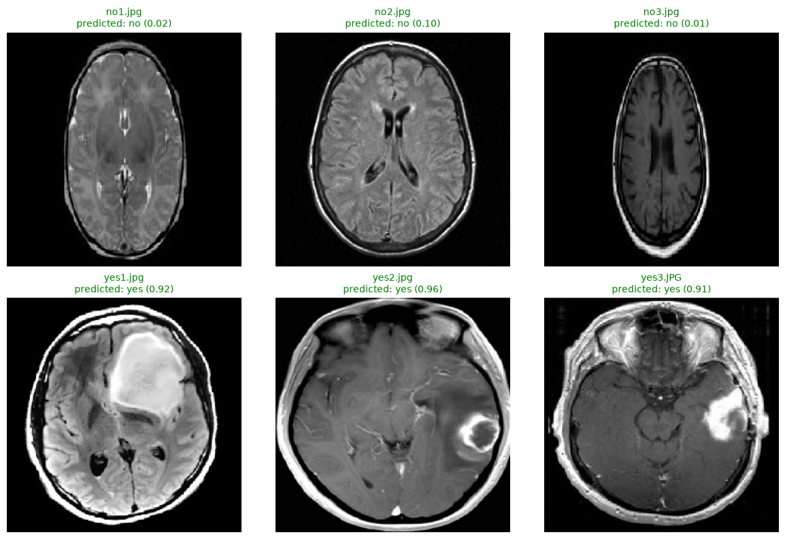

# Brain Tumor Detection with CNN

A convolutional neural network that classifies brain MRI scans as **tumor** or **no tumor**, built with TensorFlow/Keras. Includes both a plain-script workflow and a visual Jupyter Notebook version (sample images, training curves, confusion matrix, labeled predictions).



## Results

On a held-out test set of 32 images:

| Metric | Value |
|---|---|
| Accuracy | 84.4% (27/32) |
| Sensitivity (tumor recall) | 93.75% (15/16) |
| Specificity (healthy recall) | 75% (12/16) |

The model favors catching tumors over minimizing false alarms — missing only 1 real tumor while flagging 4 healthy scans for follow-up review, a tradeoff that favors patient safety in a screening context.

> **Note:** Trained on a small dataset (215 train / 32 test). Results should be treated as a learning demo, not a validated clinical tool.

## Architecture

- 3 convolutional layers (32 / 64 / 128 filters) with max pooling
- Dropout regularization (0.25, 0.5)
- Fully connected layer (128 units) → sigmoid output
- Binary classification: tumor present / absent

## Project structure

```
brain-tumor-detection/
├── Dataset/
│   ├── train/
│   │   ├── yes/          # MRI images with a tumor
│   │   └── no/           # MRI images without a tumor
│   ├── test/
│   │   ├── yes/
│   │   └── no/
│   └── prediction/       # unlabeled images to classify
├── train_model.py        # trains the CNN, saves brain_tumor_cnn.h5
├── predict.py             # classifies a single image with the trained model
├── brain_tumor_detection.ipynb   # visual notebook: training + evaluation + plots
├── requirements.txt
└── README.md
```

## Setup

Requires Python 3.10+.

```bash
python3 -m venv venv
source venv/bin/activate        # Windows: venv\Scripts\activate
pip install -r requirements.txt
```

## Usage

### Train the model

```bash
python3 train_model.py
```

This reads `Dataset/train` and `Dataset/test`, trains for 15 epochs, and saves `brain_tumor_cnn.h5`.

### Classify a new image

```bash
python3 predict.py path/to/image.jpg
```

### Run the visual notebook

```bash
jupyter notebook brain_tumor_detection.ipynb
```

Or open it directly in VS Code with the Jupyter extension. The notebook walks through data loading, a sample-image preview, model training, accuracy/loss curves, a confusion matrix, and a labeled prediction grid on the `prediction` folder.

## Dataset format

The `Dataset` folder is not included in this repo. To run this yourself, use any brain tumor MRI dataset organized with `yes`/`no` subfolders for `train` and `test`, with images of any common format (`.jpg`, `.jpeg`, `.png`). Labels are inferred automatically from folder names via Keras' `ImageDataGenerator`. Public brain tumor MRI datasets with this structure are widely available.

## Notes for adapting this to your own data

- `IMAGE_SIZE` and `BATCH_SIZE` in `train_model.py` can be adjusted for your dataset size and hardware.
- Small datasets (like the 215-image one used here) will show noisy validation accuracy between epochs — this is expected, not a bug.
- For better accuracy on small datasets, consider transfer learning (starting from a pretrained model like MobileNet or ResNet) instead of training from scratch.

## License

MIT — see [LICENSE](LICENSE).

## Disclaimer

This project is for educational purposes only and is **not a medical diagnostic tool**. Do not use it for actual clinical decision-making.
